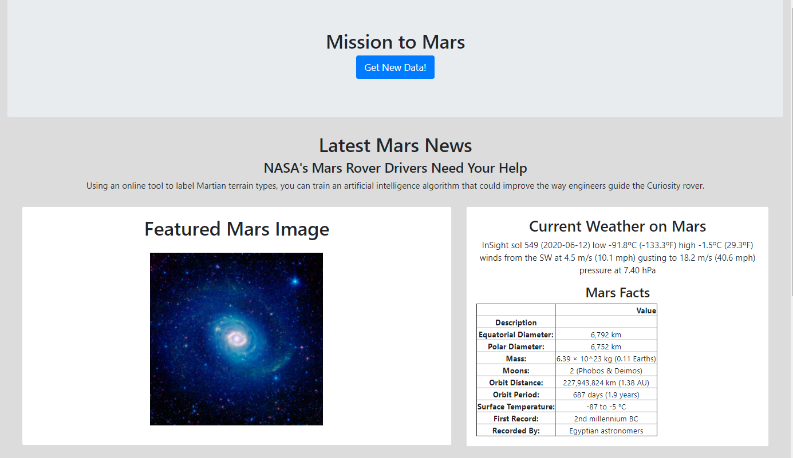

# web-scraping-challenge

### Overview

The objective of this project is to create a dashboard that presents a variety of information about Mars using web-scraping, BeautifulSoup, Pandas, and Requests/Splinter.

### Dashboard Elements

I used BeautifulSoup to parse the HTML and splinter to navitage the websites, pulling requests from the cooresponding elements.

1. NASA Mars News [here](https://mars.nasa.gov/news/)
2. JLP Mars Space Images [here](https://www.jpl.nasa.gov/spaceimages/?search=&category=Mars)
3. Mars Weather [here](https://twitter.com/marswxreport?lang=en)
4. Fars Facts [here](https://space-facts.com/mars/)
5. Mars Hemisphere Images [here](https://astrogeology.usgs.gov/search/results?q=hemisphere+enhanced&k1=target&v1=Mars)

 

